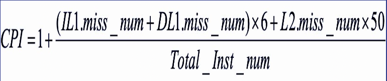

# Cache_Optimization
Computer Architecture | Experiment to determine the optimal configuration of cache to reduce the cost

## Problem Statement : 
Cache Design choices effect the performance of a microprocessor. Define the cost function and optimal configuration of a microprocessor.

## Cache Design Parameters: 
1. Cache Levels
2. Size
3. Associativity
4. Block Size
Fine tune the cache hierarchy on X86 architecture based on the gem5 simulator 

## Benchmarks
1. 401.bzip2
2. 429.mcf

Automation files used to simulate the performance of different configurations: perl script files

## Formula used to calculate CPI 
1. L1 miss penalty = 6 
2. L2 miss penalty = 50 

 

## Idea: 
<b>Optimizing CPI</b> for both benchmarks, by experimentation with different configuration of L1, L2 caches, cache line size and cache associativity

## Output Graphs: 
.png)
.png)
.png)
.png)

## Cost Function : 
1. CACHE LINE COST 
- 16 KB cache line = 16 units
- 32 KB cache line = 32 units
- 64 KB cache line = 64 units
<i> Cost doubles as cache line size doubles </i>

2. MAIN CACHE COST
- D L1 Cost = 8 units
- I L1 cost = 8 units
- L2 cost = 6 units

<i> L2 cache is cheaper than L1 cache as it is slower </i>

3. ASSOCIATIVITY COST 
- L1 associativity cost = 4 units
- L2 associativity cost = 2 units

<b>TOTAL COST = CACAHE LINE COST + MAIN CACHE COST + ASSOCIATIVITY COST </b>

---

## Observations
1. L1 Associativity keeping Data cache associativity constant, and L1 Instruction cache associativity doesn't affect the CPI . Thus keeping the least possible L1 Associativity is better (complexity and area of implementation)
increasing data associativity, increases the CPI and cost as well. 
2. Increase in L2 associativity decreases the CPI and the cost as well. 

# Result : 
1. Cache-line size =64 KB, L1_D cache size =  128KB, L1_I cache size = 128KB, L2 cache size = 1024 KB with L1_D associativity = 2 and L1_I associativity = 2, L2 associativity = 1 is optimum for 401.bzip2 benchmark.
2. Cache line size =64 KB, L1_D cache size =  128KB, L1_I cache size = 128KB, L2 cache size = 1024 KB with L1_D associativity = 16 and L1_I associativity = 4, L2 associativity = 1 is optimum for 429.mcf benchmark.
